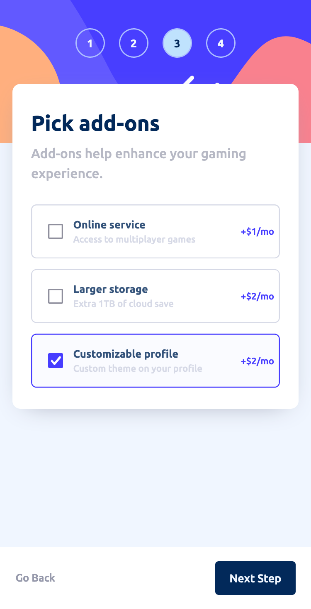

# Frontend Mentor - Multi-step form solution

This is a solution to the [Multi-step form challenge on Frontend Mentor](https://www.frontendmentor.io/challenges/multistep-form-YVAnSdqQBJ). Frontend Mentor challenges help you improve your coding skills by building realistic projects. 

## Table of contents

- [Overview](#overview)
  - [The challenge](#the-challenge)
  - [Screenshot](#screenshot)
  - [Links](#links)
- [My process](#my-process)
  - [Built with](#built-with)
  - [What I learned](#what-i-learned)
  - [Continued development](#continued-development)
  - [Useful resources](#useful-resources)
- [Author](#author)
- [Acknowledgments](#acknowledgments)

## Overview

### The challenge

Users should be able to:

- Complete each step of the sequence
- Go back to a previous step to update their selections
- See a summary of their selections on the final step and confirm their order
- View the optimal layout for the interface depending on their device's screen size
- See hover and focus states for all interactive elements on the page
- Receive form validation messages if:
  - A field has been missed
  - The email address is not formatted correctly
  - A step is submitted, but no selection has been made

### Screenshot

#### Desktop view

#### Mobile View

### Links

- Solution URL: [Solution](https://github.com/egstar/StepsForm)
- Live Site URL: [Live URL](https://egstar.github.io/StepsForm)

## My process

### Built with

- Semantic HTML5 markup
- CSS custom properties
- Flexbox
- Mobile-first workflow
- Javascript

### What I learned

No new, Old experience

### Continued development

Already experienced with all of this.

### Useful resources

None.

## Author

- Website - [Burham Soliman](https://www.Burhams.com)
- Frontend Mentor - [@Egstar](https://www.frontendmentor.io/profile/egstar)
- Twitter - [@Burham Soliman](https://www.twitter.com/bori0o)

## Acknowledgments

No teams
